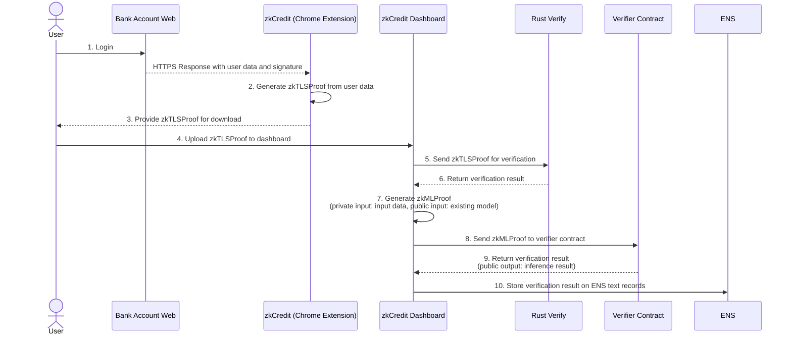

# zkCredit

### Overview
We have successfully integrated zkTLS and zkML to securely verify off-chain credit data on-chain. This enables any off-chain data to become portable, and without revealing the data itself, the inference result of zkML—the credit score—can be verified on-chain.

### Problems
A significant challenge in the current crypto industry is the difficulty of utilizing off-chain data in Web3 dApps. Relying solely on on-chain data limits the scope of what can be accomplished, as most user data exists off-chain.<br>
For instance, many existing lending protocols require over-collateralization because credit scores evaluated solely on on-chain data necessitate this precaution. However, critical credit-related data, such as income or overdue utility payments, often resides off-chain. By leveraging this off-chain data for on-chain credit score verification, the potential use cases for Web3 could be greatly expanded.


### Solution
To address this issue, we focused on two key technologies: zkTLS and zkML.<br>
zkTLS is a protocol that creates a secure gateway between private Web2 data and the Web3 ecosystem, enabling users to export data from any website securely and without needing permission from the data-holding companies. With zkTLS, Web2 data becomes portable while remaining private, and it can be verified on-chain.<br>
On the other hand, zkML is a technology that proves inference results from specific machine learning models without revealing the input data used for the inference. It verifies that the private input has undergone the correct computation process to produce the ML inference result. By leveraging zkML, data verification becomes more flexible, significantly expanding the range of verifiable data and potential use cases through the application of machine learning.<br>
By combining these two technologies, we can securely and flexibly verify off-chain data on-chain without compromising data privacy.<br>
In our demo, we implemented under-collateralized lending as a use case by utilizing off-chain credit data, employing TLS Notary and zkML.


### Usecase
- Under-collateralized lending protocols leveraging off-chain credit data.
- Whitelisting for GameFi projects and NFT marketplace launchpads using users' off-chain activities.
- Selective disclosure with privacy-preserving data through DID/VC.

### Technologies I used


### Architecture


### Implementation Status

| Title          |                                                              URL |
| :------------- | ---------------------------------------------------------------: |
| Demo Movie      |                                      [https://youtu.be/zmENJzrxZRw](https://youtu.be/WDGJQbM-rik)|
| Pitch Doc    |   [zkcredit-presentation](https://www.canva.com/design/DAGOvSFvJ4E/SfJTYw3sauGSbj1k4oQdDg/edit?utm_content=DAGOvSFvJ4E&utm_campaign=designshare&utm_medium=link2&utm_source=sharebutton) |
| Demo Site     |                                 [zkcredit-demo](https://zk-credit-teal.vercel.app/) | 
| Contract   | [zkcredit-contracts](https://github.com/wasabijiro/zkCredit/tree/main/contracts) |
| Frontend |         [zkcredit-front](https://github.com/wasabijiro/zkCredit/tree/main/frontend) |


### Development
View [`Makefile`](./Makefile)<br>
※ The backend has not been deployed yet. You need to run the backend locally.
```sh
cp frontend/.env.sample frontend/.env
cp scripts/.env.sample scripts/.env

# run tlsn server
make tlsn_server
# run regression server
make regression_server

# run frontend
make ui_install
make ui_dev
```

### What's next for

- Support for Chrome extension
- Generate TLS Notary proof on the client side
- Implement Solidity contract to verify TLS Notary proof
- Integrate TLS Notary and zkML into a single circuit

### Contracts
**Verifier Contract**

| contract                   |                                                                                                                   contract address |
| :------------------------- | ---------------------------------------------------------------------------------------------------------------------------------: |
| Ethereum Sepolia    | [0xf2c9d93716e818bda8fd9cd13b692ec5302d5568](https://sepolia.etherscan.io/address/0xf2c9d93716e818bda8fd9cd13b692ec5302d5568#code)|
| Scroll Sepolia    | [0x677ab31a9d777eedbc88ce2198dce8de9378e78f](https://sepolia.scrollscan.com/address/0x677ab31a9d777eedbc88ce2198dce8de9378e78f)|
| Nero Testnet    | [0x677aB31a9D777eEdbc88CE2198dcE8de9378E78f](https://testnetscan.nerochain.io/address/0x677aB31a9D777eEdbc88CE2198dcE8de9378E78f)|
| NeoX Testnet    | [0xC502e62C2Dc0686044572465A653CdF81Ca15A48](https://neoxt4scan.ngd.network/address/0x677ab31a9d777eedbc88ce2198dce8de9378e78f)|
| Linea Testnet   | [0x677ab31a9d777eedbc88ce2198dce8de9378e78f](https://sepolia.lineascan.build/address/0x677ab31a9d777eedbc88ce2198dce8de9378e78f)|


### References
- https://github.com/tlsnotary
- https://github.com/storswiftlabs/python2noir
- https://github.com/storswiftlabs/zkml-noir
